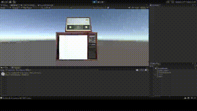
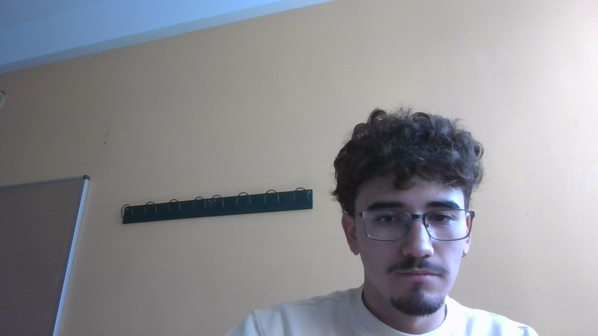
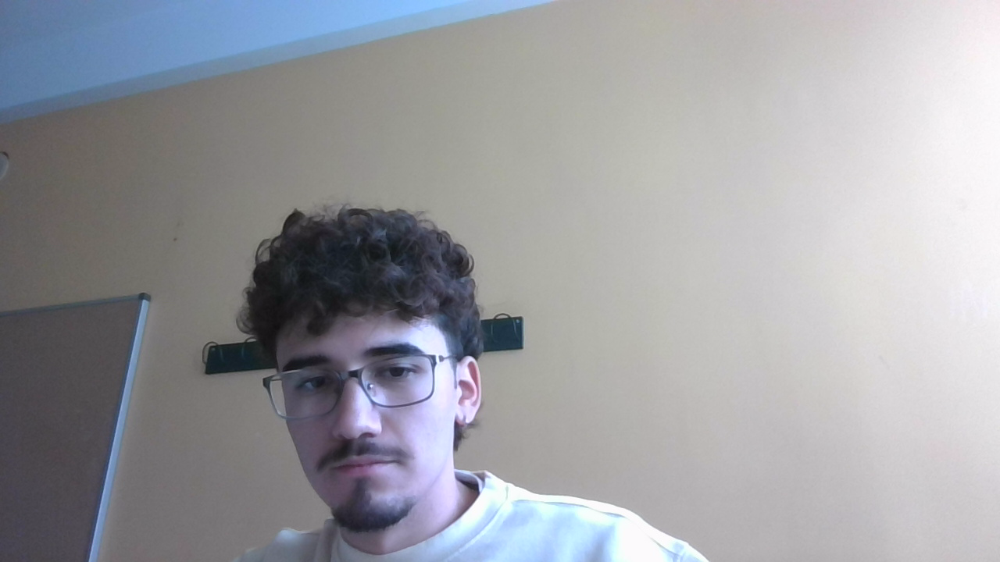

# II-P08-Camera-Microphone

Para esta práctica hemos usado componentes como el Micrófono o la Cámara del ordenador con **Unity Engine** para poder reproducir audios o imágenes en las escenas de Unity.

Primero, se modificó la escena de la cabaña para que cuando el zombie colisionase con una araña, se reprodujese un sonido de mordisco. El siguiente video muestra la ejecución:

Luego creamos una escena en la que hay un altavoz y una pantalla. Si pulsamos "R" se reproducirá el audio captado por el micrófono del ordenador y con la "P" se para de grabar el audio. Mientras que con la "S" iniciamos la captura de vídeo a través de la cámara y se muestra en la pantalla de la escena, y con "X" podemos guardar un fotograma como si fuera una captura. Para parar de capturar el vídeo también pulsamos "P".

El primer video representa la funcionalidad del micrófono, y el gif y las capturas, la de la cámara y la recuperación de fotogramas.

